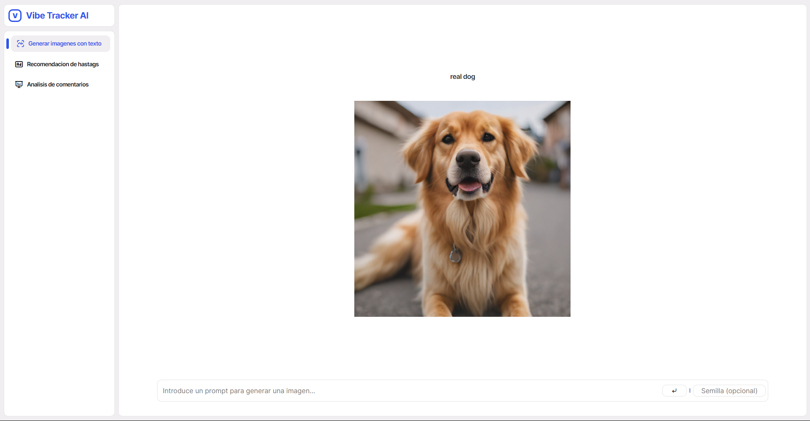
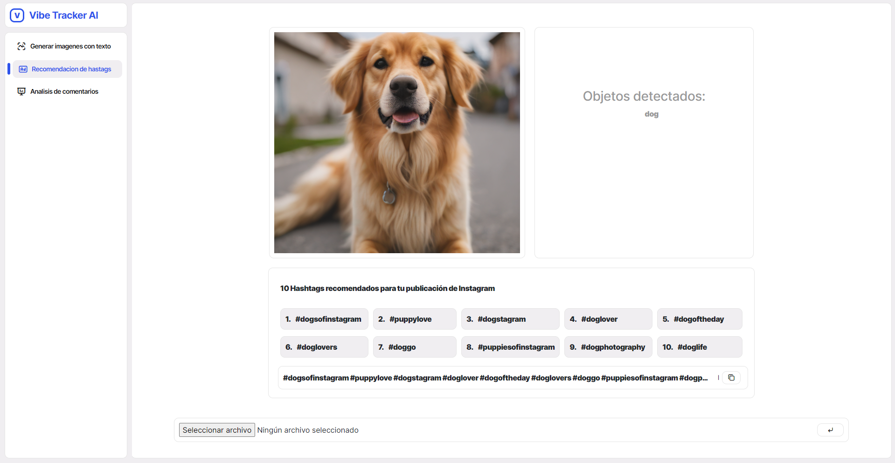
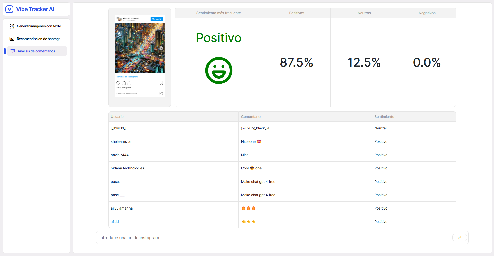
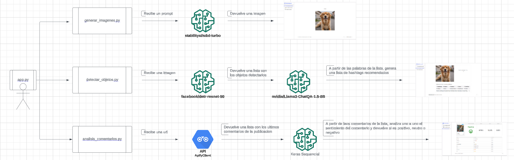

# SPRINT FINAL - VIBE TRACKER AI

<p align="center">
    
</p>

- [Introducción](#introducción)
- [Explicación de la aplicación](#explicación-de-la-aplicación)
- [Modelos y datos](#modelos-y-datos)
- [Explicación de la estructura del proyecto](#explicación-de-la-estructura-del-proyecto)
- [Posibles mejoras](#posibles-mejoras)
- [Instrucciones para crear el entorno y ejecutar el experimento base](#instrucciones-para-crear-el-entorno-y-ejecutar-el-experimento-base)


## Introducción

Vibe Tracker AI es una aplicación de análisis de datos de Instagram, que utiliza inteligencia artificial para proporcionar diversas funcionalidades que facilitan la comprensión y optimización del contenido en esta plataforma. Con tres módulos principales, ofrece capacidades de generación de imágenes, detección de objetos y recomendación de hashtags basados en los objetos detectados y análisis de sentimientos en los comentarios de las publicaciones. En la aplicación encontramos tres funcionalidades:

**Generación de Imágenes:**

Permite generar imágenes a partir de un prompt proporcionado por el usuario, utilizando modelos de inteligencia artificial entrenados para crear imágenes realistas y creativas.

<p align="center">
    
</p>


**Recomendacion de hastags**

Analiza imágenes para detectar objetos presentes en ellas, y recomienda hashtags relevantes basados en los objetos identificados. Esto ayuda a optimizar la visibilidad y el alcance de las publicaciones en Instagram.

<p align="center">
    
</p>


**Analisis de comentarios**

Evalúa el sentimiento de los comentarios en una publicación de Instagram, proporcionando información sobre la percepción general del contenido por parte de los usuarios. Esto puede ser útil para comprender la recepción del contenido y ajustar la estrategia de comunicación en consecuencia.

<p align="center">
    
</p>

## Explicación de la aplicación

La aplicación ofrece una serie de funcionalidades diseñadas para facilitar el análisis de datos de Instagram utilizando inteligencia artificial. Consta de tres módulos principales, cada uno abordando una tarea específica:

<p align="center">
    
</p>

**Generación de Imágenes:**

Este módulo permite a los usuarios generar imágenes a partir de un prompt introducido por el usuario. Utilizando el modelo "stabilityai/sdxl-turbo", la aplicación emplea inteligencia artificial para crear imágenes realistas y creativas basadas en la entrada proporcionada.

**Detección de Objetos y Recomendación de Hashtags:**

En este módulo, los usuarios pueden cargar una imagen y utilizar el modelo "facebook/detr-resnet-50" para detectar objetos presentes en la imagen. Además, utilizando el modelo "nvidia/Llama3-ChatQA-1.5-8B" se proporcionan recomendaciones de hashtags relevantes basadas en los objetos identificados. Esto ayuda a optimizar la visibilidad y el alcance de las publicaciones en Instagram.

**Análisis de Sentimientos en Comentarios:**

El tercer módulo de la aplicación se centra en el análisis de sentimientos en los comentarios de una publicación de Instagram. Para utilizar esta función, los usuarios deben proporcionar la URL de la publicación de Instagram en cuestión. La aplicación utiliza el Modelo de Red Neuronal Secuencial, entrenado con diferentes datasets, uno especifico de emojis y otro de comentarios de otra plataforma de contenido, para evaluar el sentimiento general de los comentarios, clasificándolos en categorías de positivo, neutro y negativo.

Cada uno de estos módulos se centra en aspectos específicos del análisis de datos de Instagram y utiliza modelos de inteligencia artificial entrenados para proporcionar resultados precisos y útiles. Esta diversidad de funcionalidades permite a los usuarios obtener información valiosa sobre su contenido en Instagram, facilitando la toma de decisiones informadas en su estrategia de redes sociales.

## Modelos y datos

**[stabilityai/sdxl-turbo](https://huggingface.co/stabilityai/sdxl-turbo)**

Este modelo es utilizado para generar imágenes a partir de un prompt proporcionado por el usuario. Proporciona capacidades avanzadas de generación de imágenes utilizando inteligencia artificial.

**[facebook/detr-resnet-50](https://huggingface.co/meta-llama/Meta-Llama-3-8B)**

Utilizado para la detección de objetos en imágenes. Este modelo es capaz de identificar objetos en imágenes con alta precisión.


**[nvidia/Llama3-ChatQA-1.5-8B](https://huggingface.co/nvidia/Llama3-ChatQA-1.5-8B)**

Utilizando la lista de objetos detectados en la imagen, devuelve una recomendación de hashtags relevantes. Llama3-ChatQA-1.5, destaca en la respuesta a preguntas conversacionales (QA) y en la generación aumentada por recuperación (RAG). Gracias a la lista de objetos detectados, recomienda hashtagas para la publicacion de instagram. 


**Modelo de Red Neuronal Secuencial (Sequential)**

Empleado para el análisis de sentimientos en los comentarios de las publicaciones de Instagram. Este modelo utiliza redes neuronales para evaluar el sentimiento de los comentarios y proporciona información sobre la percepción general del contenido por parte de los usuarios.

Una arquitectura de red neuronal secuencial utilizada para el análisis de sentimientos en los comentarios de las publicaciones de Instagram. Este modelo está construido con capas de Embedding, LSTM, Dropout y Dense, y está diseñado para clasificar los comentarios en tres categorías de sentimiento: positivo, neutro y negativo.

**DATASETS**

https://www.kaggle.com/datasets/cosmos98/twitter-and-reddit-sentimental-analysis-dataset?resource=download

https://huggingface.co/datasets/arbml/emoji_sentiment_lexicon

**Tecnologia utilizada**

<div>
    
    
    
    
    
    
    
    
    
    
    
    
    
    
</div>   

## Explicación de la estructura del proyecto

```
Sprint Final/
├── datasets/
│ └── emoji_sentiment_dataset.csv
│ └── Twitter_Data.csv
├── models/
    │ └── resources/
    │ └── analisis_comentarios.py
    │ └── detectar_objetos.py
    │ └── generar_imagenes.py
├── playground/
├── static/
    │ └── css/
        │ └── style_error.css
        │ └── style.css
    │ └── images/
    │ └── img/
    │ └── js/
        │ └── script.js
├── templates/
    │ └── error.html
    │ └── index.html
├── .gitignore/
├── app.py/
├── env.yml/
├── README.md/ 
```

**datasets/**

- Dentro encontraremos los datasets utilizados para entrenar los modelos de analisis de sentimientos de los comentarios de instagram.

**models/**

- Dentro encontraremos los ficheros '.py', que contienen la logica de cada menu de la aplicación.

    - **resources/**

    - Además, en esta carpeta, se guarda el tokenicer, el modelo en formato .keras y el el max_lenght, para poder cargar el modelo de manera más rápida y mejorar el rendimiento y la velocidad de la app.

**playground/**

- Dentro encontraremos los jupiter notebooks utilizados para hacer pruebas sobre los modelos utilizados. Su lógica, no aplica directamente a la aplicación, pero han sido las pruebas previas al desarrollo del codigo python de los ficheros '.py'.

**static/**

- En esta carpeta, encontraremos varias carpetas con diversas funcionalidades

    **css/**

    - En esta carpeta se situa el codigo css utilizado para el diseño.


    **images/**

    - En esta carpeta se guardaran las imagenes generadas o cargadas en los modelos.

    **img/**

    - En esta carpeta se encuentran recursos utilizados en el README o en la app.

    **js/**

    - En esta carpeta se situa el codigo js utilizado para diversas funcionalidades y mejoras de usabilidad.

**templates/**

- En esta carpeta se situa el codigo html utilizado para la estructura del proyecto

**.gitignore**

- Este fichero .gitignore, evita que se suban los archivos __pycache__ al repositorio de github.

**app.py**

- En este fichero encontraremos el codigo python necesario para poder ejecutar de manera correcta la aplicacion con Flask.

**env.yml**

- En este fichero encontraremos las dependencias necesarias para poder ejecutar el proyecto de manera correcta en un entorno con Conda.

## Posibles mejoras

A pesar de las funcionalidades existentes, siempre hay espacio para mejorar y expandir la aplicación. A continuación, se presentan algunas áreas donde se podrían realizar mejoras significativas:

**Mejora del Rendimiento de los Modelos:**

Se puede explorar la optimización y la compresión de los modelos de inteligencia artificial utilizados para mejorar su rendimiento y eficiencia computacional. Esto podría implicar la reentrenamiento de los modelos con conjuntos de datos adicionales o la implementación de técnicas de optimización específicas.

**Mejora de la Carga de Comentarios de Instagram y Conexión con la API:**

En lugar de depender de APIs externas para cargar los comentarios de Instagram, se podría considerar la integración directa con la API de Instagram. Esto permitiría una carga más rápida y eficiente de los datos, así como un control más granular sobre la obtención de información de las publicaciones.

**Incorporación de Más Funcionalidades:**

Se podría ampliar la gama de funcionalidades ofrecidas por la aplicación para abordar diversas necesidades y requisitos de los usuarios. Esto podría incluir la integración de nuevas capacidades de análisis de datos, como el análisis de la actividad de los seguidores, la identificación de tendencias emergentes o la generación de informes analíticos detallados.

## Instrucciones para crear el entorno y ejecutar el experimento base


### Instalar git

Los usuarios de Linux y Mac ya deberían tener `git` instalado de fábrica (lo podéis comprobar ejecutando `git --version`
en la consola). Si no tienes git instalado, puedes hacerlo siguiendo los pasos 
de [este link](https://git-scm.com/book/en/v2/Getting-Started-Installing-Git).

### Clona el repositorio en tu ordendador.

Clona este repositorio en tu ordenador para tener el codigo de la apliacion Vibe Tracker AI.

### Instalar conda (y Python)

Si no tienes `conda` instalado, instala `miniconda` (una distribución de conda) siguiendo
los pasos según tu sistema operativo indicados en la sección *Quick command line install* en 
[este link](https://docs.anaconda.com/free/miniconda/#quick-command-line-install).

Además esto instalará Python en tu equipo si no lo tienes.

### Instala el entorno de Python

(estos pasos los puedes hacer desde la propia terminal de VSCode)

Cierra la terminal y abre otra (esto es importante para que tengan efecto los cambios tras instalar `conda`).

Cambia a la carpeta donde has clonado este repositorio y ejecuta:


**Windows**:

```bash
path/en/tu/equipo/bootcamp-ia-sprint-4$ 
conda env create -f env.yml
conda activate vibetrackerai
```

Nota para usuarios de **Windows**, dependiendo de vuestra versión, puede que la terminal no reconozca el comando `conda`. 
En ese caso tenéis que ejecutar todos los comandos deste el `Anaconda Prompt Shell` (lo podéis encontrar buscando en el
menú de inicio una vez instalado Anaconda).


### Lanza la aplicacion Flask

En una terminal en el directorio donde está el repositorio, ejecuta:

```bash
path/en/tu/equipo/Sprint-Final$ 
conda activate vibetrackerai
flask run
```
